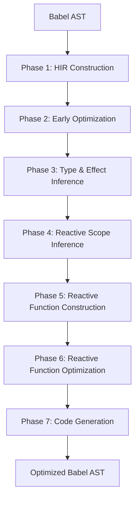

# Compiler Architecture

React Compiler transforms React code through a multi-stage pipeline consisting of over 55 distinct compiler passes organized into seven major phases.

## Pipeline Overview

The compilation pipeline is defined in `packages/babel-plugin-react-compiler/src/Entrypoint/Pipeline.ts` and executes passes in a specific order:



## Phase 1: HIR Construction

### 1. Lower (BuildHIR)

**File:** `src/HIR/BuildHIR.ts`

Converts Babel AST to High-level Intermediate Representation (HIR).

**Key Operations:**
- Creates control-flow graph (CFG) with basic blocks
- Resolves identifiers and bindings
- Converts expressions to instructions
- Makes control flow explicit (if/else, loops, etc.)

```javascript
// Input
function foo(x) {
  if (x) return true;
  return false;
}

// Output HIR
foo(x$0): $5
bb0 (block):
  [1] $2 = LoadLocal x$0
  [2] If ($2) then:bb1 else:bb2

bb1 (block):
  [3] $3 = true
  [4] Return $3

bb2 (block):
  [5] $4 = false
  [6] Return $4
```

### 2. EnterSSA

**File:** `src/SSA/EnterSSA.ts`

Converts HIR to Static Single Assignment (SSA) form.

**Key Operations:**
- Each variable assigned exactly once
- Inserts phi nodes at control flow merge points
- Creates unique identifiers for each assignment

```javascript
// Before SSA
let x;
if (cond) x = 1;
else x = 2;
return x;

// After SSA
let x$0;
if (cond) { x$1 = 1; }
else { x$2 = 2; }
x$3 = phi(x$1, x$2);
return x$3;
```

### 3. EliminateRedundantPhi

**File:** `src/SSA/EliminateRedundantPhi.ts`

Removes unnecessary phi nodes where all operands are identical.

## Phase 2: Early Optimization

### 4. ConstantPropagation

**File:** `src/Optimization/ConstantPropagation.ts`

Implements sparse conditional constant propagation.

```javascript
// Before
const x = 5;
const y = x * 2;
const z = y + 3;

// After
const x = 5;
const y = 10;
const z = 13;
```

### 5. DeadCodeElimination

**File:** `src/Optimization/DeadCodeElimination.ts`

Removes unreferenced instructions and unreachable blocks.

```javascript
// Before
const unused = expensive();
const used = cheap();
return used;

// After
const used = cheap();
return used;
```

## Phase 3: Type & Effect Inference

### 6. InferTypes

**File:** `src/TypeInference/InferTypes.ts`

Infers types using constraint-based unification.

**Inferred Types:**
- `Primitive`: numbers, strings, booleans, null, undefined
- `Object`: objects with shape information
- `Function`: functions and hooks
- `Array`: array types
- `Poly`: polymorphic types

### 7. AnalyseFunctions

**File:** `src/Inference/AnalyseFunctions.ts`

Analyzes nested functions to determine their effects and captures.

### 8. InferMutationAliasingEffects

**File:** `src/Inference/InferMutationAliasingEffects.ts`

Infers mutation and aliasing through abstract interpretation.

**Effect Types:**
```typescript
// Data flow
Capture a -> b       // b captures a
Alias a -> b         // b aliases a
Freeze value         // Make immutable

// Mutation
Mutate value         // Direct mutation
MutateTransitive     // Transitive mutation

// Special
Render place         // Used in JSX
Impure place         // Contains impure value
```

### 9. InferMutationAliasingRanges

**File:** `src/Inference/InferMutationAliasingRanges.ts`

Computes mutable ranges (instruction ranges where values can be mutated).

### 10. InferReactivePlaces

**File:** `src/Inference/InferReactivePlaces.ts`

Marks places as reactive if they:
- Are component props
- Are hook return values
- Are derived from reactive places
- Are used in JSX (render context)

## Phase 4: Reactive Scope Inference

### 11. InferReactiveScopeVariables

**File:** `src/ReactiveScopes/InferReactiveScopeVariables.ts`

Groups co-mutating variables into reactive scopes.

**Algorithm:**
1. Identify value blocks (sets of instructions creating a value)
2. Compute dependencies for each value
3. Group values with shared dependencies
4. Create scope boundaries

### 12. RewriteInstructionKindsBasedOnReassignment

**File:** `src/SSA/RewriteInstructionKindsBasedOnReassignment.ts`

Converts SSA loads to context loads for reassigned variables.

### 13-15. Scope Alignment

**Files:**
- `src/ReactiveScopes/AlignMethodCallScopes.ts`
- `src/ReactiveScopes/AlignObjectMethodScopes.ts`
- `src/ReactiveScopes/AlignReactiveScopesToBlockScopesHIR.ts`

Aligns reactive scopes to:
- Method call receivers
- Object method boundaries
- Control flow block boundaries

### 16-17. Scope Construction

**Files:**
- `src/HIR/MergeOverlappingReactiveScopesHIR.ts`
- `src/HIR/BuildReactiveScopeTerminalsHIR.ts`

Merges overlapping scopes and inserts scope terminals (start/end markers) into the CFG.

### 18-20. Scope Refinement

**Files:**
- `src/ReactiveScopes/FlattenReactiveLoopsHIR.ts`
- `src/ReactiveScopes/FlattenScopesWithHooksOrUseHIR.ts`
- `src/HIR/PropagateScopeDependenciesHIR.ts`

Flattens problematic scopes (loops, hooks) and derives minimal dependencies.

## Phase 5: Reactive Function Construction

### 21. BuildReactiveFunction

**File:** `src/ReactiveScopes/BuildReactiveFunction.ts`

Converts HIR control-flow graph to ReactiveFunction tree structure.

**Transformation:**
```
CFG (blocks + instructions) → Tree (statements + scopes)
```

## Phase 6: Reactive Function Optimization

### 22-25. Pruning Passes

**Files:**
- `src/ReactiveScopes/PruneUnusedLabels.ts`
- `src/ReactiveScopes/PruneNonEscapingScopes.ts`
- `src/ReactiveScopes/PruneNonReactiveDependencies.ts`
- `src/ReactiveScopes/PruneUnusedScopes.ts`

Removes:
- Unused labels
- Non-escaping scopes (values that don't escape function)
- Non-reactive dependencies
- Empty or unreferenced scopes

### 26-28. Scope Optimization

**Files:**
- `src/ReactiveScopes/MergeReactiveScopesThatInvalidateTogether.ts`
- `src/ReactiveScopes/PruneAlwaysInvalidatingScopes.ts`
- `src/ReactiveScopes/PropagateEarlyReturns.ts`

Optimizes:
- Merges scopes that always invalidate together
- Removes always-invalidating scopes
- Handles early returns

### 29. PromoteUsedTemporaries

**File:** `src/ReactiveScopes/PromoteUsedTemporaries.ts`

Promotes temporary variables to named variables when referenced across scopes.

## Phase 7: Code Generation

### 30. RenameVariables

**File:** `src/ReactiveScopes/RenameVariables.ts`

Ensures unique variable names in the output.

### 31. CodegenReactiveFunction

**File:** `src/ReactiveScopes/CodegenReactiveFunction.ts`

Generates final Babel AST with memoization.

**Output Structure:**
```javascript
import { c as _c } from "react/compiler-runtime";

function Component(props) {
  const $ = _c(slotCount);
  
  // Scope 1
  let t0;
  if ($[0] !== dep1) {
    t0 = compute1(dep1);
    $[0] = dep1;
    $[1] = t0;
  } else {
    t0 = $[1];
  }
  
  // Scope 2
  let t1;
  if ($[2] !== dep2) {
    t1 = compute2(dep2);
    $[2] = dep2;
    $[3] = t1;
  } else {
    t1 = $[3];
  }
  
  return <div>{t0} {t1}</div>;
}
```

## Validation Passes

Validation passes run throughout the pipeline:

**Hook Validation:**
- `ValidateHooksUsage`: Rules of Hooks compliance
- `ValidateUseMemo`: useMemo callback requirements

**Mutation Validation:**
- `ValidateLocalsNotReassignedAfterRender`: Mutation safety
- `ValidateNoSetStateInRender`: setState timing
- `ValidateNoSetStateInEffects`: Effect performance

**Dependency Validation:**
- `ValidateExhaustiveDependencies`: Complete dependencies
- `ValidateMemoizedEffectDependencies`: Effect memoization
- `ValidatePreservedManualMemoization`: Manual memo preservation

**Other Validation:**
- `ValidateNoCapitalizedCalls`: Component vs function calls
- `ValidateNoJSXInTryStatement`: Error boundary usage
- `ValidateNoRefAccessInRender`: Ref access constraints
- `ValidateSourceLocations`: Source map correctness

## Optional Transformations

These run conditionally based on configuration:

### TransformFire

**File:** `src/Transform/TransformFire.ts`  
**Flag:** `enableFire`

Transforms `fire()` calls in effects.

### LowerContextAccess

**File:** `src/Optimization/LowerContextAccess.ts`  
**Flag:** `lowerContextAccess`

Optimizes React context access with selectors.

### OutlineJsx

**File:** `src/Optimization/OutlineJsx.ts`  
**Flag:** `enableJsxOutlining`

Extracts static JSX into separate components.

### OutlineFunctions

**File:** `src/Optimization/OutlineFunctions.ts`  
**Flag:** `enableFunctionOutlining`

Outlines pure functions for better memoization.

### InferEffectDependencies

**File:** `src/Inference/InferEffectDependencies.ts`  
**Flag:** `inferEffectDependencies`

Auto-infers and inserts effect dependencies.

## Data Structures

### HIR Types

**File:** `src/HIR/HIR.ts`

```typescript
interface HIRFunction {
  body: {blocks: Map<BlockId, BasicBlock>};
  params: Array<Place | SpreadPattern>;
  context: Array<Place>;
  returns: Place;
}

interface BasicBlock {
  instructions: Array<Instruction>;
  terminal: Terminal;
  preds: Set<BlockId>;
  phis: Set<Phi>;
}

interface Instruction {
  id: InstructionId;
  lvalue: Place;
  value: InstructionValue;
  effects: Array<AliasingEffect> | null;
  loc: SourceLocation;
}
```

### ReactiveFunction

**File:** `src/ReactiveScopes/ReactiveFunction.ts`

```typescript
interface ReactiveFunction {
  params: Array<Place | SpreadPattern>;
  context: Array<Place>;
  body: ReactiveBlock;
  returnType: Type;
}

interface ReactiveScope {
  range: InstructionRange;
  declarations: Map<IdentifierId, ReactiveScopeDeclaration>;
  dependencies: Array<ReactiveScopeDependency>;
}
```

## Performance Characteristics

### Pass Complexity

- **Lowering**: O(n) where n = AST nodes
- **SSA Conversion**: O(n + e) where e = CFG edges
- **Type Inference**: O(n²) worst case (unification)
- **Effect Inference**: O(n·d) where d = average dependencies
- **Scope Inference**: O(n·s) where s = scope count
- **Codegen**: O(n + s)

### Memory Usage

- HIR: ~200 bytes per instruction
- Type variables: ~50 bytes each
- Reactive scopes: ~100 bytes + dependencies
- Total: ~1-5MB for typical component

## Debugging

### Enable Debug Output

Implement a logger to see each pass:

```javascript
class DebugLogger {
  debugLogIRs(value) {
    console.log(`[${value.kind}] ${value.name}`);
  }
}
```

### Test Runner

Use the `snap` test runner:

```bash
# Run with debug output
yarn snap -p fixture-name -d

# Compile any file with debug
yarn snap compile --debug path/to/file.js
```

## Next Steps

<CardGroup cols={2}>
  <Card title="HIR" icon="sitemap" href="/compiler/hir">
    Understand the intermediate representation
  </Card>
  <Card title="Optimization Passes" icon="wand-magic-sparkles" href="/compiler/optimization-passes">
    Learn about specific optimizations
  </Card>
  <Card title="Contributing" icon="code-pull-request" href="/compiler/contributing">
    Contribute to the compiler
  </Card>
  <Card title="Configuration" icon="sliders" href="/compiler/configuration">
    Configure compiler behavior
  </Card>
</CardGroup>
