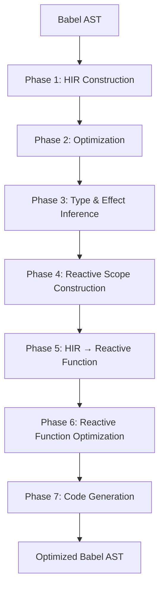

# How React Compiler Works

React Compiler transforms React components through a multi-phase pipeline, converting your code into an optimized version with automatic memoization.

## High-Level Architecture

The compiler pipeline consists of seven major phases:



## Phase 1: HIR Construction

### Lowering to HIR

The compiler first converts Babel's Abstract Syntax Tree (AST) to a **High-level Intermediate Representation (HIR)**.

HIR represents code as a **control-flow graph (CFG)** with:
- **Basic blocks**: Sequences of instructions
- **Instructions**: Individual operations
- **Terminals**: Control flow between blocks (if, return, loop, etc.)

```javascript
// Original code
function foo(x, y) {
  if (x) {
    return foo(false, y);
  }
  return [y * 10];
}
```

```
// HIR representation
foo(x$0, y$1): $12
bb0 (block):
  [1] $6 = LoadLocal x$0
  [2] If ($6) then:bb2 else:bb1

bb2 (block):
  [3] $2 = LoadGlobal foo
  [4] $3 = false
  [5] $4 = LoadLocal y$1
  [6] $5 = Call $2($3, $4)
  [7] Return $5

bb1 (block):
  [8] $7 = LoadLocal y$1
  [9] $8 = 10
  [10] $9 = Binary $7 * $8
  [11] $10 = Array [$9]
  [12] Return $10
```

### SSA Conversion

The HIR is converted to **Static Single Assignment (SSA)** form, where:
- Each variable is assigned exactly once
- Phi nodes represent values from different control flow paths
- Enables precise dataflow analysis

```javascript
// Original
let x;
if (condition) {
  x = 1;
} else {
  x = 2;
}
return x;
```

```
// SSA form with phi node
let x$1;
if (condition) {
  x$2 = 1;
} else {
  x$3 = 2;
}
x$4 = phi(x$2, x$3)  // Merge point
return x$4;
```

## Phase 2: Optimization

Early optimization passes improve code quality:

### Constant Propagation

Replaces variables with known constant values:

```javascript
// Before
const x = 5;
const y = x + 3;

// After
const x = 5;
const y = 8;
```

### Dead Code Elimination

Removes unreferenced instructions:

```javascript
// Before
const unused = expensiveCalculation();
const used = simpleValue();
return used;

// After
const used = simpleValue();
return used;
```

## Phase 3: Type & Effect Inference

### Type Inference

The compiler infers types using constraint-based unification:
- Primitives (string, number, boolean, null, undefined)
- Objects (with shape information)
- Functions (including hooks)
- Arrays and JSX elements

```javascript
const [count, setCount] = useState(0);
// Inferred types:
// - useState: Function<BuiltInUseState>
// - count: Primitive
// - setCount: Function<BuiltInSetState>
```

### Effect Inference

Infers **aliasing and mutation effects** through abstract interpretation:

**Effect Types:**

```typescript
// Data flow effects
Capture a -> b      // b captures a mutably
Alias a -> b        // b aliases a
Assign a -> b       // Direct assignment
Freeze value        // Make immutable

// Mutation effects
Mutate value        // Direct mutation
MutateTransitive    // Mutates transitively

// Special effects
Render place        // Used in JSX/render
Impure place        // Contains impure value
```

**Example:**

```javascript
function Component({ items }) {
  const filtered = items.filter(x => x.active);
  return <List data={filtered} />;
}
```

```
// Effects:
// items: Render (used in JSX context)
// filtered: Capture items -> filtered
// filtered: Render (passed to JSX)
```

## Phase 4: Reactive Scope Construction

### Inferring Reactive Scopes

The compiler groups instructions that should invalidate together into **reactive scopes**:

```javascript
function Component({ a, b }) {
  // Scope 1: depends on 'a'
  const x = a * 2;
  const y = x + 1;
  
  // Scope 2: depends on 'b'
  const z = b * 3;
  
  return { x, y, z };
}
```

### Scope Alignment

Scopes are aligned to:
- Control flow boundaries (if/else, loops)
- Method call receivers
- Object method declarations
- Block scopes

### Scope Merging

Overlapping or always-invalidating-together scopes are merged:

```javascript
// Before: two scopes
const x = props.a;
const y = x + 1;  // Scope 1
const z = y + 2;  // Scope 2

// After: merged into one scope
const x = props.a;
const y = x + 1;
const z = y + 2;  // Single scope
```

## Phase 5: HIR → Reactive Function

The control-flow graph is converted to a tree structure (**ReactiveFunction**) where:
- Scopes become explicit nodes
- Dependencies are tracked
- Nesting relationships are preserved

## Phase 6: Reactive Function Optimization

### Pruning Passes

Multiple passes prune unnecessary scopes:

- **Non-escaping scopes**: Values that don't escape the function
- **Scopes with hooks**: Can't memoize hook calls
- **Always-invalidating**: Scopes that always recompute
- **Unused scopes**: Empty or unreferenced scopes

### Dependency Optimization

```javascript
// Before: over-specified dependency
const x = props.user.profile.name;
// Depends on: props

// After: precise dependency
const x = props.user.profile.name;
// Depends on: props.user.profile.name
```

## Phase 7: Code Generation

The final phase generates optimized JavaScript:

### Memoization Cache

```javascript
import { c as _c } from "react/compiler-runtime";

function Component(props) {
  const $ = _c(4);  // Create cache with 4 slots
  
  let t0;
  if ($[0] !== props.value) {  // Check dependency
    t0 = expensiveCalc(props.value);  // Recompute
    $[0] = props.value;  // Update dependency
    $[1] = t0;           // Cache result
  } else {
    t0 = $[1];  // Use cached result
  }
  
  return <div>{t0}</div>;
}
```

### Scope Structure

```javascript
// Multiple reactive scopes
function Component({ a, b, c }) {
  const $ = _c(6);
  
  // Scope 1: depends on 'a'
  let t0;
  if ($[0] !== a) {
    t0 = computeX(a);
    $[0] = a;
    $[1] = t0;
  } else {
    t0 = $[1];
  }
  
  // Scope 2: depends on 'b'
  let t1;
  if ($[2] !== b) {
    t1 = computeY(b);
    $[2] = b;
    $[3] = t1;
  } else {
    t1 = $[3];
  }
  
  // Scope 3: depends on t0 and t1
  let t2;
  if ($[4] !== t0 || $[5] !== t1) {
    t2 = <div>{t0} {t1}</div>;
    $[4] = t0;
    $[5] = t1;
    $[6] = t2;
  } else {
    t2 = $[6];
  }
  
  return t2;
}
```

## When the Compiler Bails Out

The compiler may bail out (skip compilation) when:

### Unsupported JavaScript Features

- `eval()` calls
- `with` statements
- `var` declarations (use `let`/`const`)
- Nested `class` declarations

### Rule Violations

- Conditional hook calls
- Unconditional `setState` during render
- Direct `ref.current` access in render
- Mutations after value is frozen

### Complex Patterns

- Deeply nested closures capturing mutable state
- Dynamically created components
- Certain imperative patterns

## Compiler Error Types

### Todo Errors (Graceful Bailout)

```
Todo: Support [feature]
```

Known limitation, compiler skips this function but continues.

### Invariant Errors (Hard Failure)

```
Invariant violation: [condition]
```

Unexpected state, indicates compiler bug or invalid input.

### Validation Errors

```
InvalidReact: [description]
```

Code violates Rules of React, must be fixed.

## Performance Characteristics

### Compilation Time

- Typically 1-5ms per component
- Scales linearly with code size
- Cached between builds

### Runtime Overhead

- Memoization checks: O(1) per scope
- Cache storage: ~1-2 slots per reactive value
- Minimal memory overhead

### Optimization Benefits

- Reduces re-renders by 50-90% in typical apps
- Eliminates need for manual memoization
- Improves performance on low-end devices

## Next Steps

<CardGroup cols={2}>
  <Card title="Architecture" icon="diagram-project" href="/compiler/architecture">
    Deep dive into compiler passes
  </Card>
  <Card title="HIR" icon="sitemap" href="/compiler/hir">
    Understanding the intermediate representation
  </Card>
  <Card title="Optimization Passes" icon="wand-magic-sparkles" href="/compiler/optimization-passes">
    Learn about specific optimizations
  </Card>
  <Card title="Configuration" icon="sliders" href="/compiler/configuration">
    Configure compiler behavior
  </Card>
</CardGroup>
